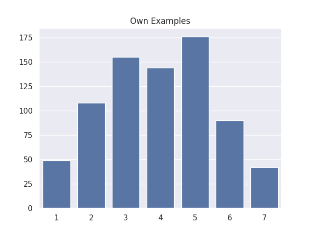
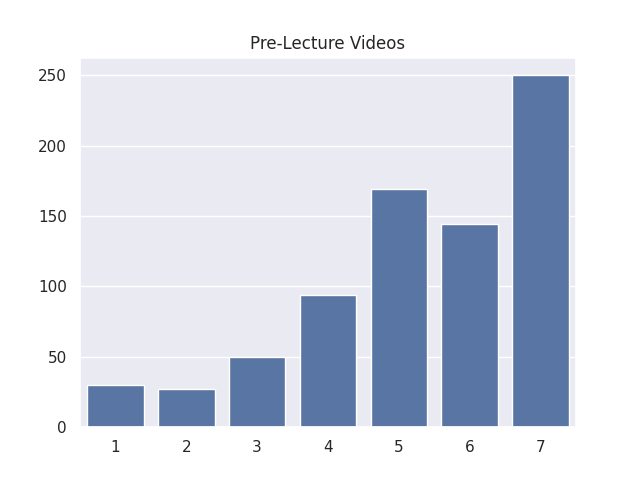
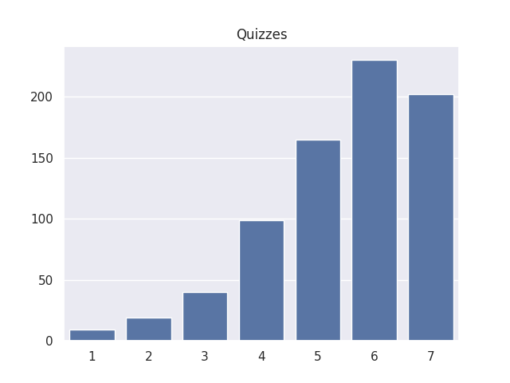

---
# Do not edit the text between these lines!
layout: default
---

# COMP110 FINAL PROJECT (Leamsy Leon + Aminah Imran)

## Introduction
For this final assignment in COMP110, we analyzed student survey data to explore ways to improve the course in a way that is beneficial to its stakeholders (students, instructional staff, the academic institution, and the societal workforce). To begin, we brainstormed several ideas for improving the course.

The ideas are listed below:

1. This course should use pre-class readings because they would help students understand what they are going to work on during class time. This benefits students who want to come to class more prepared.
2. This course should add recitations to provide a structured time for students to work on assignments and receive individual help. This benefits students who need additional support and structure.
3. This course should offer different sections based on student background or major (for example, separating students with prior experience from those taking the course as a prerequisite). This benefits students with different levels of experience.
4. This course should create an app to help students review content in a more engaging and interactive way. This benefits students who prefer mobile-friendly and hands-on learning tools.
5. The course slides should be more detailed to better support student learning and studying. This benefits all students, especially when reviewing material outside of class.

After brainstorming, we evaluated which ideas could be supported by the available data. We concluded that the idea of adding recitations cannot be fully analyzed because there is no current data showing whether recitations improve student performance or understanding in this course.

To collect this data in the future, we could survey students about their experiences in courses that include recitations and whether they believe recitations improve their learning. Additionally, we could experimentally offer optional recitation sessions and compare the performance and feedback of students who attend versus those who do not.

We then selected the idea of implementing pre-class readings for further analysis. This idea was chosen because there is existing data related to similar resources, such as pre-lecture videos, making it more feasible to analyze. Additionally, this idea has strong potential to improve student preparedness and engagement with relatively minimal changes to the course structure.

## Analysis
To analyze whether pre-class readings could be beneficial, we examined three related variables from the dataset: "own_examples," "pre_lecture_videos," and "qz_effective."

We selected these variables because:

"pre_lecture_videos" serves as a proxy for pre-class readings, since both are preparatory materials.
"own_examples" reflects how actively students engage with the material.
"qz_effective" indicates whether study-related activities are helpful for learning.

Before beginning our analysis, we previewed the dataset to better understand its structure.

We then processed the data by combining survey datasets, selecting relevant columns, and converting values from strings to integers for numerical analysis. After cleaning the data, we calculated the frequency of responses for each variable.

We visualized the data using bar plots, since the variables are based on Likert scale responses (1–7), which are categorical in nature.

The bar plots show that both "pre_lecture_videos" and "qz_effective" have negatively skewed distributions, meaning most responses are concentrated at higher values (6–7). This suggests that students generally find pre-lecture videos and quiz preparation helpful for their learning.

In contrast, "own_examples" has a more centered distribution, with many responses in the middle range (3–5). This indicates that students are less consistent in creating their own examples when learning new concepts.

These patterns suggest that while students value structured learning resources (such as videos and quizzes), they may be less likely to independently engage in deeper learning strategies like creating their own examples.

The code we used to do this is written below with comments explaining the code:
import seaborn as sns # This imports the Seaborn library which is used to create statistical graphs. Sns is a short name for Seaborn.
import matplotlib.pyplot as plt # This imports the plotting tools from the Matplotlib library. This allows us to create the graphs we want.
from data_utils import (
    read_csv_rows,
    columnar,
    concat,
    select,
    convert_columns_to_int,
    count,
    head
) # This imports the functions we have in data_utils. This allows us to read our data files, manipulate them, and count values in columns.

sns.set_theme() # This sets the theme, to make the graphs look nicer.

izzi_rows = read_csv_rows("data/survey_izzi.csv") # This reads the data from survey_izzi.csv and stores it in a list of dictionaries called izzi_rows. Each dictionary represents a row of data, with the keys being the column names and the values being the data for that row.
alyssa_rows = read_csv_rows("data/survey_alyssa.csv") # This reads the data from survey_alyssa.csv and stores it in a list of dictionaries called alyssa_rows. Each dictionary represents a row of data, with the keys being the column names and the values being the data for that row.

izzi_table = columnar(izzi_rows) # This turns the data from izzi_rows into a column-oriented table, which is a dictionary. The keys of the dictionary are the column names, and the values are lists of the data in those columns.
alyssa_table = columnar(alyssa_rows) # This does the same for alyssa_rows.

combined = concat(izzi_table, alyssa_table) # This one combines the two tables into one table called combined. This allows us to work with all the data from both surveys at once.

preview = head(combined, 10) # This previews the first 10 rows of the combined dataset so we can understand its structure before analyzing it.
print(preview)

selected = select(
    combined,
    ["own_examples", "pre_lecture_videos", "qz_effective"]
) # This selects only the columns we are interested in from the combined table.

clean = convert_columns_to_int(
    selected,
    ["own_examples", "pre_lecture_videos", "qz_effective"]
) # This converts the values in the selected columns from strings to integers. This allows us to do numerical analysis on the data.

def filter_high_values(column: list[int], threshold: int) -> list[int]:# Helper function to find values above a threshold
    """Returns values greater than a threshold."""
    result: list[int] = []
    for value in column:
        if value > threshold:
            result.append(value)
    return result

high_pre = filter_high_values(clean["pre_lecture_videos"], 5) # This uses the helper function to find how many students rated pre-lecture videos highly (above 5).

own_freq = count(clean["own_examples"]) # This counts the frequency of each value in the "own_examples" column and stores it in a dictionary called own_freq. The keys of the dictionary are the unique values in the column, and the values are the counts of how many times each value appears.
pre_freq = count(clean["pre_lecture_videos"]) # This does the same for the "pre_lecture_videos" column.
qz_freq = count(clean["qz_effective"]) # This does the same for the "qz_effective" column.

plt.figure() # This create a new graph. This is necessary because we want to create multiple graphs, and if we don't create a new one, all the graphs will be drawn on top of each other.
sns.barplot(x=list(own_freq.keys()), y=list(own_freq.values())).set(title="Own Examples") # This creates a bar plot for the "own_examples" column. The x-axis has the unique values from the column, and the y-axis has the counts of how many times each value appears.
plt.savefig("static/imgs/own_examples.png") # This saves the graph so we can use it on our website.

plt.figure()
sns.barplot(x=list(pre_freq.keys()), y=list(pre_freq.values())).set(title="Pre-Lecture Videos") # This also creates a bar plot but for the "pre_lecture_videos" column.
plt.savefig("static/imgs/prelecture.png") # This saves the graph.

plt.figure()
sns.barplot(x=list(qz_freq.keys()), y=list(qz_freq.values())).set(title="Quizzes") # This also creates a bar plot but for the "qz_effective" column.
plt.savefig("static/imgs/quizzes.png") # This saves the graph.

plt.show() # This displays all the graphs we have created. If we don't call this, the graphs will not be displayed.

<!-- This is a comment. Below, you'll see code for inserting an image. To make this image appear, update <custom-path>. To add an image, save it inside the imgs folder of this repository. -->
## Visualizations

## Own Examples

## Pre-lecture Video

## Quiz Effectiveness

## Conclusion
Based on our analysis, the results are inconclusive regarding whether pre-class readings would improve the course. While students generally find pre-lecture videos and quiz preparation effective, we cannot directly conclude that readings would produce the same outcomes.

However, the data does suggest that structured learning resources are valuable to students. This indicates that pre-class readings could potentially support student understanding, especially if they are designed to reinforce key concepts and provide clear guidance.

There are also trade-offs to consider. Adding required readings would increase the workload for students in an already time-intensive course. It could also require additional effort from the instructional team to create or curate effective materials. If readings require a textbook, this could introduce additional financial costs.

One possible refinement of this idea would be to keep readings optional or concise, or to reduce the workload in other areas of the course to balance the added time commitment.

To further evaluate this idea, future work could involve implementing pre-class readings in some sections of the course and comparing outcomes such as quiz performance, assignment grades, and student feedback. Additionally, surveys could directly ask students whether readings improved their understanding or engagement.

Overall, while the data does not provide a definitive answer, it suggests that structured preparatory materials have value, and pre-class readings could be a promising direction for future course improvements.